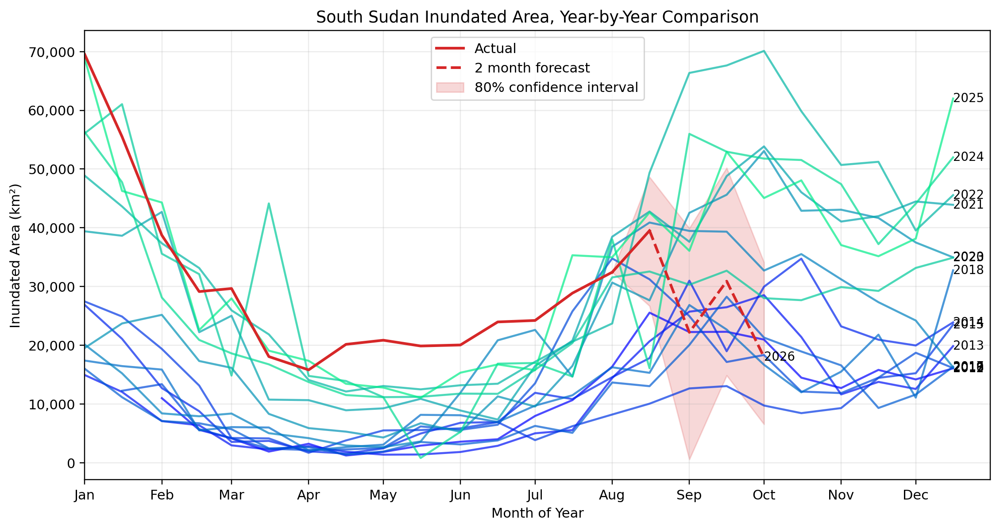

# INFLOW-AI Flood Inundation Prediction

INFLOW-AI downloads and processes hydrological, satellite, rainfall, moisture, lake-level, and teleconnection data for the INFLOW study area. It trains and evaluates temporal ablation models, retrains the selected model on the latest available history, and produces two-month inundation forecasts with uncertainty intervals and explanations.



## Requirements

- Python 3.11 or newer
- macOS, Linux, or Windows
- Network access for the first data download and later source updates

Install dependencies in a virtual environment:

```bash
python3 -m venv .venv
source .venv/bin/activate        # Windows: .venv\Scripts\activate
python3 -m pip install -r requirements.txt
```

## First Run

1. Review [config.yaml](config.yaml), especially `runtime.target_product`.
2. Run the ablation experiments:

```bash
python3 -m model.ablation.run_ablation
```

3. Run the prediction pipeline:

```bash
python3 __main__.py
```

The first data run takes substantially longer. It downloads and builds the historic record for the spatial and temporal datasets, including HDF5 files and aligned temporal CSVs. Later runs update only the available period.

No external data folder needs to be downloaded or copied into the repository. The pipeline creates its required data products under `data/`.

<<<<<<< HEAD
## Outputs
=======
4. **Run Ablation Experiments**:
`python -m model.ablation.run_ablation --models random_forest,gradient_boosting,elastic_net --cutoff-dates 2025-12-31 --autoregressive-values yes,no --target-types raw,first_differenced,deseasonalised,seasonally_differenced,differenced_anomaly --inundation-products viirs,modis --seed 42`

This writes:
- model weights (`.pkl`) to `model/ablation/models/weights/`
- experiment metadata and performance metrics to `model/ablation/ablation_experiment_log.csv`


>>>>>>> origin/main

The main run writes forecasts under `predictions/`, including:

- `temporal_predictions.csv`: historical values and future predictions
- `model_performance.json`: selected model, test metrics, preprocessing, and runtime retraining metadata
- `prediction_year_by_year_comparison.png` and other forecast plots
- `explanations/shap_waterfall_lead_*.png`: SHAP driver plots for each forecast lead
- `explanations/shap_metadata.json`: explanation metadata and contribution percentages

A cumulative forecast ledger is written to `predictions/forecast_performance.csv`.

<<<<<<< HEAD
## Configuration
=======
---

## Ablation Pipeline

The repository now includes a dedicated ablation framework in `model/ablation/` with:

- One class per model in its own Python file:
  - `model/ablation/models/random_forest_model.py`
  - `model/ablation/models/gradient_boosting_model.py`
  - `model/ablation/models/elastic_net_model.py`
- Corresponding serialized model weight files as `.pkl` artifacts in:
  - `model/ablation/models/weights/`
- Reproducibility controls:
  - Global random seed set for `random`, `numpy`, and TensorFlow (if available)
- Experiment tracking in a single CSV log:
  - `model/ablation/ablation_experiment_log.csv`

Each logged experiment row includes:

- Ablation dimensions:
  - `model_type`
  - `training_cutoff_date`
  - `autoregressive`
  - `target_type` (`raw`, `first_differenced`, `deseasonalised`, `seasonally_differenced`, `differenced_anomaly`)
  - `inundation_product` (`viirs` or `modis`)
  - `seed`
- Dataset properties:
  - source path, row counts, feature count
  - date range
  - target mean/std
  - dataset fingerprint hash
- Performance metrics:
  - `calibration`
  - `twcrps`
  - `mae`
  - `rmse`
  - `quantile_loss_95`
  - `quantile_loss_99`
  - `peak_precision`
  - `peak_recall`
  - `peak_auc`
  - `peak_f1`

>>>>>>> origin/main

The main settings are in [config.yaml](config.yaml).

### Runtime

```yaml
runtime:
  target_product: "viirs"   # viirs or modis
```

The target product controls the inundation source, aligned historic directory, temporal cadence, and forecast target.

### Ablation experiments

The `ablation.experiments` section controls the experiment grid:

- `models`
- `training_cutoff_dates`
- `autoregressive_values`
- `target_types`
- `inundation_products`
- `seed`
- `log_path`

The `ablation.pipeline` section controls shared model preparation:

- `target_column`
- forecast horizon
- calendar features
- target and feature lag blocks
- lag steps such as `[1, 2, 3, 6, 12]`
- feature selection thresholds and candidate feature counts
- optional PCA

Experiment weights, scalers, feature-selection caches, PCA artifacts, and runtime-retrained weights are stored beneath the configured `ablation.artifacts.base_dir`.

## Ablation Results

The ablation runner records experiment metadata and metrics in:

```text
model/ablation/ablation_experiment_log.csv
```

It stores the selected experiment metadata in:

```text
model/best_temporal_model.json
```

The main pipeline consumes that metadata, uses the selected feature subsets and transformations, retrains the same model architecture on current data, and then forecasts.

## License

This project is licensed under the [MIT License](LICENCE.md).

## Contact

For questions or issues, contact Jessica Rapson at jessica.rapson@algorithmicgovernance.org.
